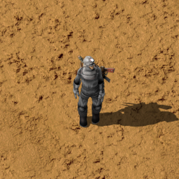
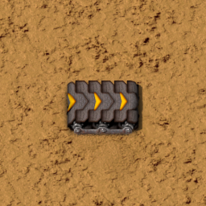
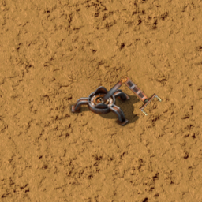
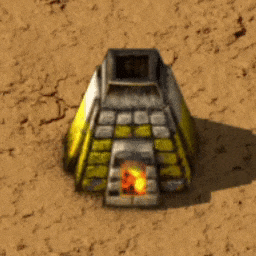
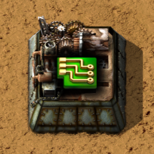
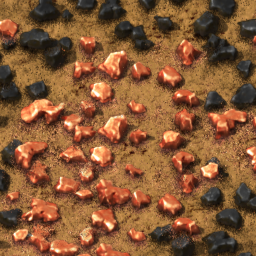
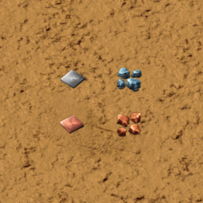
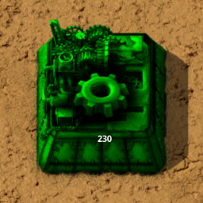

# Factorio-Imitation

## 라이브러리
* [WinAPI (Windows API)](https://docs.microsoft.com/en-us/windows/win32/)
* [OpenGL](https://www.opengl.org/)
* [GLM (OpenGL Mathematics)](https://github.com/g-truc/glm)
* [GLEW (OpenGL Extension Wrangler Library)](http://glew.sourceforge.net/)
* [stb_image (Image Loader)](https://github.com/nothings/stb#stb)

## 사용한 기술
#### Design Pattern
* 팩토리 메소드 패턴 (Factory Method Pattern)
* 싱글톤 패턴 (Singleton Pattern)
* [상태 패턴 (State Pattern)](#상태-패턴-state-pattern)
	
#### OpenGL  
* 셰이더 (GLSL)
	* Vertex Buffer Object
	* Uniform Buffer Object
* [인스턴싱 (Instancing)](#인스턴싱-Instancing)
    
#### STL
* vector
* map
* multimap
   
## 구현 목록
#### [캐릭터 (Character)](#캐릭터-character-1)

#### 구조물 (Structure)
* [화력 채광 드릴 (Burner Mining Drill)](#화력-채광-드릴-burner-mining-drill)
* [운송 벨트 (Transport Belt)](#운송-벨트-transport-belt)
* [투입기 (Inserter)](#투입기-inserter)
* [돌 용광로 (Stone Furnace)](#돌-용광로-stone-furnace)
* [조립 기계 1 (Assembling Machine 1)](#조립-기계-1-assembling-machine-1)

#### [제작법 (Recipe)](#제작법-recipe-1)
---
    
    
## 정의부

### [상태 패턴 (State Pattern)](#design-pattern)
* 객체의 실행 코드를 상태에 따라 다르게 처리해야 할때 사용한다.
* 패턴이 사용된 객체: [캐릭터 (Character)](#캐릭터-character-1), [구조물 (Structure)](#구조물-structure-1)

### OpenGL(Open Graphics Library)
* 하드웨어 가속으로 컴퓨터 그래픽을 처리할 수 있게 돕는 라이브러리다. 
* 2D, 3D 그래픽 라이브러리

### 인스턴싱 (Instancing)
* 서로 비슷한 요소들을 한번에 GPU로 넘겨주어 한번에 렌더한다.  
* CPU와 GPU간의 통신이 반복되지 않아 딜레이가 적어 속도가 빠르다.  

* 기술이 사용된 객체: [타일(Tile)](#타일-tile), [광물(Ore)](#광물-ore), [땅 위의 아이템(Item On Ground)](#땅-위의-아이템-item-on-ground)

### [캐릭터 (Character)](#캐릭터-character)
	엔티티 (Entity)/ 캐릭터 (Character)
header file: [Character.h](Factorio-Imitation/Character.h)  

* 조작
	> 플레이어는 게임에서 행동을 할때 캐릭터를 통하여 이루어진다.  
	> 공장을 확장하기 위해서 [구조물 빌더](#구조물-빌더-structure-builder)로 구조물들을 건설하거나 철거할 수 있다.
    
* 상태
	* 유휴 (Idle)
	* 달리기 (Running)
   
* 인벤토리
	* 보유중인 아이템을 획득하면 기존의 아이템과 합쳐진다.
	
### [구조물 (Structure)](#구조물-structure)
	엔티티 (Entity)/ 구조물 (Structure)
header file: [Structure.h](Factorio-Imitation/Structure.h)  

* 건설될 수 있는 객체다.
* [상태 패턴](#상태-패턴-state-pattern)을 사용하여 구조물의 상태에 따라 다르게 동작한다.

### [화력 채광 드릴 (Burner Mining Drill)](#구조물-structure)
	구조물 (Structure)/ 화력 채광 드릴 (Burner Mining Drill)
header file: [BurnerMiningDrill.h](Factorio-Imitation/BurnerMiningDrill.h)  

* 타일에 있는 광물을 채취한다.
* 연료를 에너지로 사용한다.
* 배출구로 광물을 배출한다.

### [운송 벨트 (Transport Belt)](#구조물-structure)
	구조물 (Structure)/ 운송 벨트 (Transport Belt)
header file: [TransportBelt.h](Factorio-Imitation/TransportBelt.h)  

* 벨트위에 올라가있는 아이템들을 진행 방향으로 이동시킨다.
* 벨트의 종류에 따라 속도가 다르다.
* 사방의 운송벨트와 상호 작용하여 진행 방향이 바뀐다

### [투입기 (Inserter)](#구조물-structure)
	구조물 (Structure)/ 투입기 (Inserter)
header file: [BurnerInserter.h](Factorio-Imitation/BurnerInserter.h)  

* 구조물에 아이템을 투입한다.
* 구조물에서 아이템을 반출한다.
* 방향에 따라 집게팔 이미지가 회전한다.

### [돌 용광로 (Stone Furnace)](#구조물-structure)
	구조물 (Structure)/ 돌 용광로 (Stone Furnace)
header file: [StoneFurnace.h](Factorio-Imitation/StoneFurnace.h)  

* 굽기 제작법이 있는 아이템들을 가공한다.
* 연료를 에너지로 사용한다.
* 다른 구조물로부터 아이템을 받을 수 있다.
* 다른 구조물이 완성품을 가져갈 수 있다.

### [조립 기계 1 (Assembling Machine 1)](#구조물-structure)
	구조물 (Structure)/ 조립 기계 1 (Assembling Machine 1)
header file: [AssemblingMachine1.h](Factorio-Imitation/AssemblingMachine1.h)  

* 제작법을 선택하고 재료를 받으면 완성품을 생산한다.
* 다른 구조물로부터 아이템을 받을 수 있다.
* 다른 구조물이 완성품을 가져갈 수 있다.

### 타일 매니저 (Tile Manager)
#### 청크 (Chunk)
header file: [Chunk.h](Factorio-Imitation/Chunk.h)  

* 타일 32 * 32개를 구성하는 단위
* 인스턴싱 기법으로 청크단위로 화면에 그려진다.
* 음수 좌표를 사용하기 위해 map을 사용해 저장한다.

#### 타일 (Tile)
header file: [Tile.h](Factorio-Imitation/Tile.h)  

* 그리드의 기본 단위
* 광물을 가지고 있다.
* 타일 위에 지어진 구조물의 링크를 저장한다.
#### 광물 (Ore)
header file: [Ore.h](Factorio-Imitation/Ore.h)  

* 타일에 있는 광물의 종류와 양을 저장한다.
* 광물은 철 광석, 구리 광석, 돌, 석탄이 있다.

### 엔티티 매니저 (Entity Manager)
* 엔티티 매니저는 구조물들과 땅 위의 아이템을 관리하고 캐릭터와 구조물 빌더를 가지고 있다.
* 엔티티 저장
	> 엔티티들을 자연스럽게 보이기 위하여 왼쪽 위부터 출력해야 한다.  
	> 그래서 좌표값을 키값으로 multimap에 넣어 정렬과 함께 저장하였다.
	
#### 땅 위의 아이템 (Item On Ground)

* 인스턴싱 기법을 사용하여 땅 위의 아이템들을 일괄적으로 화면에 출력한다.
* 화면 안에 있는 아이템만을 추리고 출력해 성능을 최적화했다.

#### [구조물 빌더 (Structure Builder)](#구조물-structure)
header file: [StructureBuilder.h](Factorio-Imitation/StructureBuilder.h)  

* 임시 구조물
	* 마우스 좌표에 임시로 구조물을 배치하여 표시한다.
* 활성화
	* 설치 가능한 아이템을 핸드에 들었을 때 활성화한다.
	

### 제작법 (Recipe)
header file: [Recipe.h](Factorio-Imitation/Recipe.h)  
* 아이템의 제작 재료를 정의 해놓은 자료 구조
